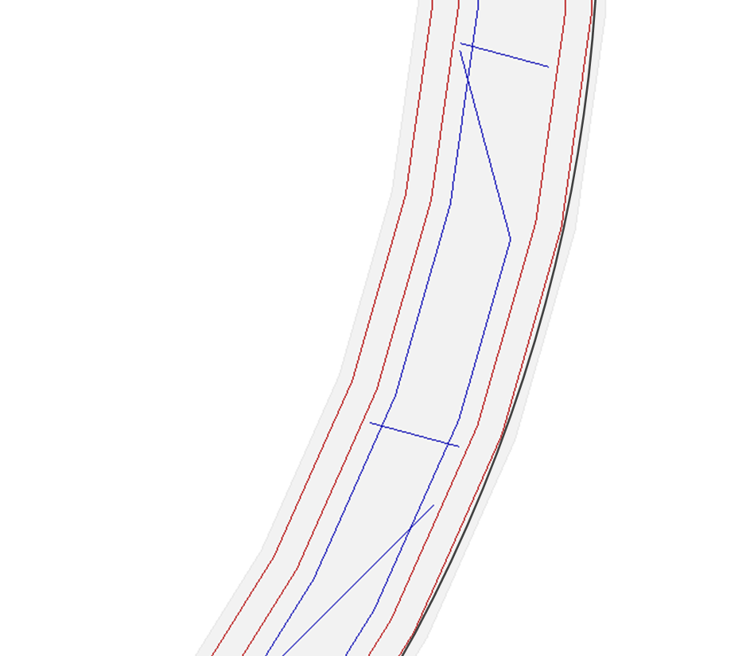

# 3d Print Smoothing

This script can undo the triangulation/facetting that gets created when a 3d model is saved as an .stl file.  It is a conversion of some 
Linuxcnc code to fit an arc to a series of points.  

The example below shows a ring, 50mm in diameter with 45 facets...

## Limitations
This will only work with 3d printers that support G2 and G3 (CW and CCW arc).  The latest Marlin based firmwares (Prusa printers) support this.

The process is only useful for cleaning up suttle facetting on the perimeter.  Large facets, which effect the infill, will not work.

Two examples are shown below.  The first shows the small offset the arc (black line) makes to the perimeter (red line).  The second example
shows larger corrections.  Note that the arc now gets very close to the infill (blue line) on inside arcs.  It also moves away from the 
infill on outside arcs.  This will introduce voids.  

The arcs are also only fitted in the XY plane - that is, as soon as the z axis moves, the arc fitting stops.  This means this filter
can't be used for spiral printing.

## Use
The script is written in python 2.XX.  It is run using a batch file, g1tog23.bat.

I use this with Slic3r, set up as a post-processing script...

## Configuration
In the main python file, there are 4 configuration variables.  These usually don't have to be changed.

| Variable         | Default | Definition                                                                                            |
|------------------|---------|-------------------------------------------------------------------------------------------------------|
| point_tolerance  | 0.05    | The error tolerance of how far a point can be off the fitted arc. This is measured perpendicular to the arc.|
| length_tolerance | 0.005   | Maximum difference between the length of the straight line segments and the length of the fitted arc. ie. arc_len < line_path_length * length_tolerance |
| extruderLetter   | 'E'     | The GCode letter used for the extruder.  Usually 'E' but can be 'A' in linuxcnc systems.              |
| extrudeRelative  | True    | Are the extruder distances relative or absolute.  The Prusa distances are relative.                   |
